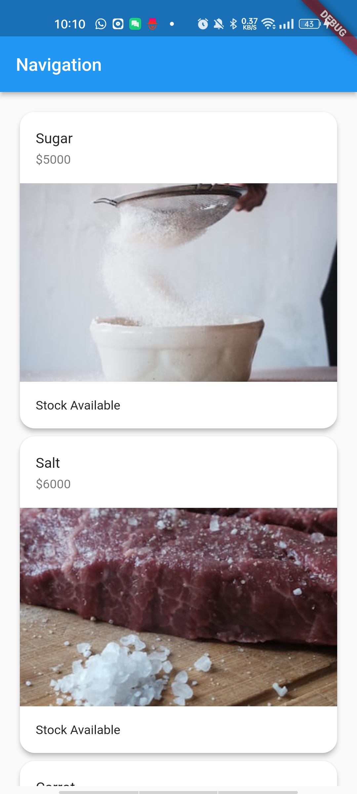

# Description

Ini adalah kode untuk sebuah aplikasi Flutter yang menggunakan navigasi untuk berpindah antara halaman. Terdapat dua halaman yang dapat diakses melalui rute yaitu "HomePage" dan "ItemPage". "HomePage" adalah halaman awal yang ditampilkan ketika aplikasi dibuka, sedangkan "ItemPage" adalah halaman yang ditampilkan ketika pengguna menavigasi ke halaman tersebut.

Pada home page merupakan implementasi dari sebuah toko online sederhana yang menampilkan daftar barang-barang yang dijual. Di halaman utama (HomePage), ditampilkan daftar barang-barang yang dijual dalam bentuk card yang berisi informasi tentang barang tersebut seperti nama, harga, dan ketersediaan stok. Ketika card di-tap, aplikasi akan menavigasikan pengguna ke halaman detail barang (ItemPage) yang menampilkan informasi lebih lengkap tentang barang tersebut.
  
Pada item page adalah contoh penggunaan Flutter untuk membuat tampilan UI untuk menampilkan informasi suatu item. Pada halaman ini, pengguna dapat melihat informasi mengenai suatu item, seperti nama item, harga, stok, dan gambar. Halaman ini diakses melalui navigasi dari halaman Home dan membutuhkan data item sebagai argument yang disimpan pada objek Item.

Kelas Item merupakan kelas model yang berisi informasi mengenai suatu item dalam aplikasi. Kelas ini memiliki empat atribut, yaitu name, price, stock, dan url, yang masing-masing merepresentasikan nama item, harga item, ketersediaan item, dan URL gambar item.

Selain atribut-atribut tersebut, kelas Item juga memiliki sebuah constructor yang menerima empat parameter bertipe data yang berbeda sesuai dengan atribut-atribut yang dimilikinya. Constructor ini digunakan untuk menginisialisasi nilai dari atribut-atribut tersebut saat sebuah objek Item dibuat.

Dengan adanya kelas Item, informasi mengenai sebuah item dapat diwakili dengan satu objek, dan objek-objek ini dapat digunakan pada berbagai bagian dalam aplikasi, seperti pada list item yang ditampilkan pada halaman utama atau pada halaman detail item.
  
## Output

Detail Item

